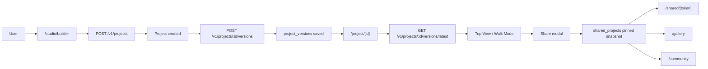

# Plan2Space Developer Handbook

이 문서는 Plan2Space 저장소를 처음 보는 사람을 위한 가장 넓고 쉬운 설명서입니다.

목표는 세 가지입니다.

1. 이 프로젝트가 "무엇을 만드는지" 한 번에 이해하게 한다.
2. 왜 이런 기술을 골랐는지, 각 기술이 어떤 문제를 해결하는지 설명한다.
3. 어떤 파일을 어디서 읽어야 하는지, 어떤 순서로 학습하면 되는지 알려준다.

이 문서는 코딩을 잘 모르는 사람도 읽을 수 있게 썼습니다. 대신 실제 구현 파일과 운영 문서까지 연결해 두었기 때문에, 엔지니어가 실무 참고 문서로 써도 됩니다.

## 1. 한 문장 설명

Plan2Space는 실내 공간을 만들고 편집하고 공유하는 웹 서비스입니다.

현재의 기본 사용자 흐름은 이렇습니다.

1. 빈 방을 만든다.
2. 3D 에디터에서 가구와 마감재를 배치한다.
3. Top View와 Walk Mode를 오가며 확인한다.
4. 저장한다.
5. 공유 링크, 갤러리, 커뮤니티로 공개한다.

과거에는 "도면 업로드 -> AI 분석 -> 3D 생성"이 기본 진입이었지만, 현재 public web 제품은 "builder-first"로 바뀌었습니다. 다만 AI 파이프라인과 worker는 저장소 안에 여전히 남아 있습니다. 이유는 두 가지입니다.

- 과거 프로젝트를 복구하고 운영할 필요가 있기 때문
- 장기적으로 AI 기반 공간 생성 기능을 다시 확장할 수 있기 때문

즉, 현재 저장소는 "builder-first product"와 "legacy AI pipeline"이 함께 들어 있는 하이브리드 구조입니다.

## 2. 지금 제품이 실제로 동작하는 방식

### 2.1 public product flow

사용자가 실제로 많이 보게 되는 경로는 아래입니다.

- `/`
  - 랜딩 페이지
- `/studio`
  - 스튜디오 허브
- `/studio/builder`
  - 빈 방 생성 시작점
- `/project/[id]`
  - 메인 3D 에디터
- `/shared/[token]`
  - 읽기 전용 공유 뷰어
  - pinned version이 없는 예전 share row는 public contract에서 제외된다
- `/gallery`
  - 공개된 room archive
  - showcase API가 깨지면 empty state가 아니라 unavailable state를 보여준다
- `/community`
  - 공개된 room feed
  - showcase API가 깨지면 empty state가 아니라 unavailable state를 보여준다

### 2.2 data flow



핵심은 `project_versions`입니다.

- 에디터는 항상 "최신 저장본"을 기준으로 다시 열립니다.
- 공유 링크는 `project_version_id`가 박힌 "현재 상태를 고정한 snapshot"만 public viewer에서 엽니다.
- 갤러리와 커뮤니티는 그 pinned snapshot을 다시 보여줍니다.

## 3. 왜 이런 기술을 골랐는가

이 섹션은 기술 이름을 나열하는 문서가 아닙니다. "왜 꼭 이 기술이어야 했는지"를 설명합니다.

### 3.1 Next.js 14 App Router

왜 쓰나:

- 페이지 라우팅이 안정적이다.
- public page와 authenticated editor를 한 저장소에서 관리하기 쉽다.
- server component와 client component를 섞어 쓸 수 있다.
- Vercel 배포에 잘 맞는다.

이 프로젝트에서 하는 일:

- 랜딩, 스튜디오, 공유 뷰어, 커뮤니티 같은 화면 라우팅
- 서버에서 Supabase를 읽어야 하는 공유 페이지 렌더링
- 메타데이터와 layout 관리

처음 배우는 사람이 이해할 포인트:

- `app/` 폴더 안의 `page.tsx`는 URL 하나를 뜻한다.
- `layout.tsx`는 모든 페이지를 감싸는 공통 틀이다.
- `use client`가 붙은 파일은 브라우저에서 실행된다.

### 3.2 React

왜 쓰나:

- 화면을 컴포넌트 단위로 쪼개기 좋다.
- 에디터처럼 상태가 많은 UI를 다루기 편하다.

이 프로젝트에서 하는 일:

- 버튼, 패널, 카드, 모달 같은 UI 전부
- 상태 변화에 따라 3D 에디터 shell을 다시 그리기

배울 포인트:

- props
- state
- effect
- component composition

### 3.3 React Three Fiber

왜 쓰나:

- Three.js를 React 스타일로 다룰 수 있다.
- 복잡한 3D scene도 컴포넌트처럼 나눌 수 있다.
- React 상태와 3D 씬을 자연스럽게 연결할 수 있다.

이 프로젝트에서 하는 일:

- 벽, 바닥, 천장, 가구, 조명, 포스트프로세싱 렌더링
- Top View와 Walk Mode 전환

배울 포인트:

- `Canvas`
- mesh / material / light
- camera
- scene graph

### 3.4 Zustand

왜 쓰나:

- 3D 편집기에서 전역 상태를 단순하게 다룰 수 있다.
- Redux보다 가볍고 빠르다.
- React re-render를 과도하게 만들지 않는다.

이 프로젝트에서 하는 일:

- 현재 프로젝트 정보
- 현재 씬 데이터
- 에디터 shell 상태
- 선택된 가구
- undo/redo history

배울 포인트:

- "store"는 앱 전체가 공유하는 상태 박스다.
- 컴포넌트가 직접 props를 길게 전달하지 않아도 된다.

### 3.5 Supabase

왜 쓰나:

- Postgres 데이터베이스
- 인증
- 파일 저장소
- SQL 기반 운영이 쉬움

이 프로젝트에서 하는 일:

- 사용자 로그인
- 프로젝트/버전/공유 데이터 저장
- 썸네일, 업로드 파일 저장

배울 포인트:

- table
- row
- storage bucket
- auth session

### 3.6 Railway

왜 쓰나:

- 무거운 API/worker를 Vercel에서 분리하기 좋다.
- 환경 변수 관리가 편하다.
- Node 서비스 운영이 단순하다.

이 프로젝트에서 하는 일:

- Express API 서버 운영
- background worker 운영
- production env에서 backfill 같은 ops 작업 실행

### 3.7 Worker architecture

왜 쓰나:

- AI 분석과 geometry 생성은 느리고 무겁다.
- 웹 요청과 분리해야 UI가 안정적이다.

이 프로젝트에서 하는 일:

- floorplan analysis
- geometry normalization
- revision / scene artifact generation
- asset generation background jobs

### 3.8 Tailwind CSS

왜 쓰나:

- 빠르게 UI를 조립할 수 있다.
- 디자인 토큰을 클래스 형태로 일관되게 적용하기 쉽다.

이 프로젝트에서 하는 일:

- builder/editor/share/community 모든 표면 스타일링

### 3.9 Framer Motion

왜 쓰나:

- 로딩, panel, modal, shell 전환이 부드럽다.

이 프로젝트에서 하는 일:

- landing transition
- panel 등장/퇴장
- editor shell 상태 전환

### 3.10 Playwright CLI

왜 쓰나:

- 브라우저를 자동으로 열고 실제 화면을 점검할 수 있다.

이 프로젝트에서 하는 일:

- public surface smoke test
- builder/auth gate 검증
- 공유/갤러리/커뮤니티 검수

## 4. Monorepo 구조를 한 번에 이해하기

루트는 monorepo입니다. 즉, 한 저장소 안에 여러 앱이 같이 들어 있습니다.

### 4.1 최상위 구조

- `apps/web`
  - 사용자 웹앱
- `apps/api`
  - Railway API
- `apps/worker`
  - background worker
- `packages/contracts`
  - API/도메인 타입 계약
- `packages/floorplan-core`
  - floorplan core 로직 패키지
- `packages/shared`
  - 공유 타입 모음
- `docs`
  - 운영 및 기술 문서
- `supabase/migrations`
  - 데이터베이스 변경 기록
- `infra/railway`
  - Railway 배포 설정
- `scripts`
  - 루트 유틸리티 스크립트

## 5. 앱별 역할

### 5.1 `apps/web`는 무엇인가

이 저장소에서 가장 "제품처럼 보이는" 부분입니다.

사용자가 보는 것:

- 랜딩
- 스튜디오
- builder
- project editor
- shared viewer
- gallery
- community
- 로그인/회원가입

여기서 중요한 개념은 두 가지입니다.

1. UI shell
2. scene state

UI shell은 패널, 버튼, 모달, 뷰 모드 같은 "겉모습과 조작 방식"이고,
scene state는 벽, 바닥, 천장, 가구 위치 같은 "실제 방 데이터"입니다.

### 5.2 `apps/api`는 무엇인가

사용자 요청을 받아서 데이터베이스와 worker 사이를 이어주는 서버입니다.

하는 일:

- 프로젝트 생성/조회/삭제
- project version 저장
- 공유 링크 관련 API
- intake/floorplan/job/revision API
- catalog 및 asset 관련 API

### 5.3 `apps/worker`는 무엇인가

백그라운드에서 오래 걸리는 일을 처리합니다.

하는 일:

- floorplan job 처리
- asset generation job 처리
- geometry build
- revision / scene artifact 생성

## 6. 현재 제품에서 꼭 이해해야 하는 핵심 데이터 모델

### 6.1 `projects`

"방 하나"의 상위 개념입니다.

예:

- 내 프로젝트 목록에 보이는 카드 1개
- 이름, 설명, 썸네일, 메타데이터를 가짐

### 6.2 `project_versions`

실제 편집 snapshot입니다.

예:

- 방을 저장할 때마다 쌓이는 기록
- editor는 최신 version을 다시 불러옴
- share는 특정 version을 고정해서 공개함

이 프로젝트에서 가장 중요한 제품 데이터는 사실상 `project_versions`입니다.

### 6.3 `shared_projects`

공유 링크 데이터입니다.

예:

- `/shared/[token]`
- gallery 공개 여부
- pinned snapshot id

### 6.4 `layout_revisions`

AI 기반 도면 분석의 canonical truth입니다.

현재 public builder flow는 여기 없이도 동작하지만,
legacy project 운영과 AI pipeline에서는 여전히 중요합니다.

### 6.5 `floorplans`, `jobs`, `floorplan_results`

이 셋은 legacy/ops/AI pipeline 쪽 데이터입니다.

- `floorplans`
  - 업로드된 도면
- `jobs`
  - worker가 처리할 작업
- `floorplan_results`
  - 분석 결과

## 7. 사용자 흐름별 설명

### 7.1 Builder-first 흐름

1. 사용자가 `/studio/builder`로 들어간다.
2. 방 템플릿과 치수, 마감재를 선택한다.
3. 프로젝트를 만든다.
4. 첫 `project_version`이 저장된다.
5. `/project/[id]` 에디터로 이동한다.

이 흐름은 현재 제품의 기본값입니다.

### 7.2 Editor 흐름

1. `/project/[id]` 진입
2. `GET /v1/projects/:id/versions/latest`
3. saved version을 scene state로 변환
4. Top View에서 가구/마감재 편집
5. autosave 또는 manual save

### 7.3 Share / Gallery / Community 흐름

1. editor에서 share modal을 연다.
2. 현재 latest saved version을 pinned snapshot으로 고정한다.
3. `/shared/[token]`이 그 version을 read-only로 보여준다.
4. gallery에 공개하면 `/gallery`에 나타난다.
5. community에서는 큐레이션된 public feed처럼 보여준다.

### 7.4 Legacy AI pipeline 흐름

1. intake session 생성
2. 업로드 또는 search
3. API가 resolution 결정
4. worker가 floorplan job 처리
5. revision/result 저장
6. project finalize

중요:

- 이 흐름은 여전히 저장소 안에 존재한다.
- 하지만 현재 public web의 기본 프로젝트 생성 경로는 아니다.

## 8. 핵심 엔트리 파일

이 파일들을 먼저 보면 구조를 빨리 이해할 수 있습니다.

### web

- `apps/web/src/app/layout.tsx`
  - 모든 페이지의 공통 레이아웃
- `apps/web/src/app/page.tsx`
  - 랜딩 페이지
- `apps/web/src/app/studio/builder/page.tsx`
  - builder 시작점
- `apps/web/src/app/(editor)/project/[id]/page.tsx`
  - 메인 editor
- `apps/web/src/app/shared/[token]/page.tsx`
  - shared viewer entry
- `apps/web/src/lib/stores/useSceneStore.ts`
  - 방/가구/히스토리 상태의 중심
- `apps/web/src/lib/stores/useProjectStore.ts`
  - 프로젝트 목록/현재 프로젝트 상태
- `apps/web/src/components/editor/SceneViewport.tsx`
  - 공통 3D viewport

### api

- `apps/api/src/server.ts`
  - 서버 시작점
- `apps/api/src/app.ts`
  - 라우터 등록
- `apps/api/src/routes/projects.ts`
  - 프로젝트/버전 저장 API
- `apps/api/src/routes/showcase.ts`
  - gallery/community용 공개 데이터 API
- `apps/api/src/services/legacy-backfill-service.ts`
  - old project를 versioned snapshot으로 이관

### worker

- `apps/worker/src/worker.ts`
  - worker 메인 루프
- `apps/worker/src/processors/floorplan-processor.ts`
  - floorplan job 처리
- `apps/worker/src/pipeline/*`
  - 분석/정규화/scene 생성 파이프라인

## 9. 로컬 실행 방법

### 9.1 가장 단순한 시작

```bash
npm install
npm run dev:web
```

브라우저:

- `http://127.0.0.1:3100`

주의:

- `NEXT_PUBLIC_RAILWAY_API_URL`이 없으면 `/gallery`, `/community`, showcase 관련 검증은 empty state가 아니라 unavailable state로 보이게 된다.
- 즉 local smoke test에서 showcase가 비어 보인다면, 먼저 데이터가 없는지보다 API URL env가 빠졌는지 확인해야 한다.

### 9.2 전체 서비스 개발 모드

터미널 1:

```bash
npm run dev:web
```

또는 showcase/share까지 같이 검증하려면 `apps/web/.env.local`에 `NEXT_PUBLIC_RAILWAY_API_URL`을 넣고 시작한다.

터미널 2:

```bash
npm run dev:api
```

터미널 3:

```bash
npm run dev:worker
```

### 9.3 자주 쓰는 검증 명령

```bash
npm --workspace apps/web run lint
npm --workspace apps/web run build
npm --workspace apps/web run type-check
npm --workspace apps/api run typecheck
npm --workspace apps/worker run typecheck
```

### 9.4 운영성 스크립트

```bash
npm --workspace apps/api run backfill:legacy-project-versions -- --dry-run --limit 20
npm --workspace apps/web run smoke:preview-runtime -- --url=<preview-url> --expected=<railway-url>
npm --workspace apps/web run e2e:intake -- --api=<railway-url>
```

## 10. 배포 구조

### 10.1 Vercel

- public web 제품 배포
- Next.js app host

### 10.2 Railway

- `apps/api`
- `apps/worker`
- production env 관리

### 10.3 Supabase

- database
- auth
- storage

## 11. 어떤 문서를 먼저 읽어야 하는가

이 순서로 읽는 것이 가장 좋습니다.

1. `new_guideline/README.md`
2. `docs/developer-handbook.md` (이 문서)
3. `docs/master-guide.md`
4. `docs/implementation-plan.md`
5. `docs/user-action-guide.md`
6. `docs/ai-pipeline.md`
7. `docs/3d-visual-engine.md`
8. `docs/file-role-index.md`

## 12. 비개발자를 위한 학습 순서

### Step 1. 웹앱이 무엇인지 이해하기

배우면 좋은 것:

- 브라우저
- 서버
- 데이터베이스
- 로그인
- API

이 저장소에서 볼 파일:

- `README.md`
- `docs/developer-handbook.md`

### Step 2. React와 Next.js 이해하기

배우면 좋은 것:

- 컴포넌트
- props
- state
- route
- server/client component

이 저장소에서 볼 파일:

- `apps/web/src/app/layout.tsx`
- `apps/web/src/app/page.tsx`
- `apps/web/src/app/studio/page.tsx`

### Step 3. 상태 관리 이해하기

배우면 좋은 것:

- 전역 상태
- store
- undo/redo

이 저장소에서 볼 파일:

- `apps/web/src/lib/stores/useProjectStore.ts`
- `apps/web/src/lib/stores/useSceneStore.ts`
- `apps/web/src/lib/stores/useEditorStore.ts`

### Step 4. 3D 웹 이해하기

배우면 좋은 것:

- scene
- camera
- mesh
- light
- material

이 저장소에서 볼 파일:

- `apps/web/src/components/editor/SceneViewport.tsx`
- `apps/web/src/components/canvas/core/CameraRig.tsx`
- `apps/web/src/components/canvas/features/ProceduralWall.tsx`
- `apps/web/src/components/canvas/features/Furniture.tsx`

### Step 5. API 서버 이해하기

배우면 좋은 것:

- request
- response
- middleware
- auth

이 저장소에서 볼 파일:

- `apps/api/src/app.ts`
- `apps/api/src/routes/projects.ts`
- `apps/api/src/routes/showcase.ts`
- `apps/api/src/middleware/auth.ts`

### Step 6. 백그라운드 작업 이해하기

배우면 좋은 것:

- queue
- worker
- async job

이 저장소에서 볼 파일:

- `apps/worker/src/worker.ts`
- `apps/worker/src/queue/claim-next-job.ts`
- `apps/worker/src/processors/floorplan-processor.ts`

### Step 7. 데이터베이스와 배포 이해하기

배우면 좋은 것:

- migration
- environment variable
- production vs preview

이 저장소에서 볼 파일:

- `supabase/migrations/*`
- `docs/deployment.md`
- `docs/user-action-guide.md`

## 13. 이 프로젝트를 수정할 때 기본 원칙

1. 사용자 공개 표면은 builder-first를 기준으로 본다.
2. 저장과 공유의 기준 데이터는 `project_versions`다.
3. shared link는 pinned snapshot이다.
4. gallery/community는 mock이 아니라 실제 공개 snapshot을 보여줘야 한다.
5. legacy AI pipeline은 남아 있지만, active web 기본 경로와 혼동하면 안 된다.
6. 문서가 코드와 다르면 문서를 먼저 고친다.

## 14. 자주 하는 작업과 진입 파일

### 랜딩 수정

- `apps/web/src/app/page.tsx`
- `apps/web/src/components/landing/landing-hero-canvas.tsx`
- `apps/web/src/components/navigation/PremiumNavbar.tsx`

### builder 수정

- `apps/web/src/app/studio/builder/page.tsx`
- `apps/web/src/components/editor/BuilderLaunchState.tsx`

### editor shell 수정

- `apps/web/src/app/(editor)/project/[id]/page.tsx`
- `apps/web/src/components/editor/ProjectEditorHeader.tsx`
- `apps/web/src/components/editor/BuilderLibraryShelf.tsx`
- `apps/web/src/components/editor/BuilderInspectorPanel.tsx`
- `apps/web/src/components/editor/SceneViewport.tsx`

### share / gallery / community 수정

- `apps/web/src/components/editor/ShareModal.tsx`
- `apps/web/src/app/shared/[token]/page.tsx`
- `apps/web/src/app/shared/[token]/SharedProjectClient.tsx`
- `apps/web/src/app/gallery/page.tsx`
- `apps/web/src/app/community/page.tsx`
- `apps/api/src/routes/showcase.ts`

### 저장/버전 수정

- `apps/web/src/lib/api/project.ts`
- `apps/api/src/routes/projects.ts`
- `apps/api/src/services/project-version-service.ts`

### legacy/ops 수정

- `apps/api/src/routes/scenes.ts`
- `apps/api/src/services/legacy-backfill-service.ts`
- `apps/api/scripts/backfill-legacy-project-versions.ts`
- `docs/user-action-guide.md`

### AI pipeline 수정

- `apps/api/src/routes/intake.ts`
- `apps/worker/src/processors/floorplan-processor.ts`
- `apps/worker/src/pipeline/*`
- `docs/ai-pipeline.md`

## 15. 초보자가 자주 헷갈리는 것

### "scene"와 "project"는 같은가

아닙니다.

- `project`는 상위 컨테이너
- `project_version`은 실제 저장 snapshot
- `scene`은 그 snapshot을 화면에 펼친 결과

### 왜 web 말고 api/worker가 따로 있나

브라우저에서 무거운 분석을 돌리면 느리고 불안정하기 때문입니다.

### 왜 예전 AI 코드가 아직 남아 있나

운영, 백필, 향후 확장 때문입니다.

### 왜 gallery/community가 project list가 아니라 shared snapshot을 기준으로 하나

나중에 편집한 draft 때문에 공개 링크가 흔들리면 안 되기 때문입니다.

## 16. 앞으로 누가 이 저장소를 맡더라도 기억해야 할 것

이 프로젝트의 핵심은 "3D를 잘 그리는 것" 하나가 아닙니다.

실제로는 아래 네 층이 동시에 맞아야 합니다.

1. 사용자 경험
2. 저장 모델
3. 공유 모델
4. 운영 가능한 백엔드

이 네 층이 현재는 아래처럼 정리돼 있습니다.

- public web는 builder-first
- 저장의 기준은 project_versions
- 공개의 기준은 pinned snapshots
- legacy AI pipeline은 ops/확장 레이어

이 원칙을 유지하면, 누가 들어와도 저장소를 망가뜨리지 않고 이어서 개발할 수 있습니다.
