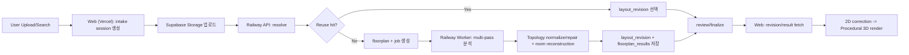

# Floorplan -> 3D Flow (Intake-First)

## 한눈에 보는 흐름

## 단계별 동작
1. 웹에서 이미지 파일 선택.
2. `/api/v1` 계열(또는 ops compatibility 경로)에서 intake session 생성을 시작한다.
3. 파일을 Supabase Storage에 직접 업로드.
4. intake resolve 경로가 exact reuse 또는 catalog match를 먼저 시도한다.
5. reuse가 없으면 worker job을 생성하고 `queued/analyzing` 상태로 진행.
6. worker가 `claim_jobs`로 잡 점유 후 분석, repair, room reconstruction 수행.
7. 성공 시 `layout_revisions`와 `floorplan_results` 저장.
8. `review_required`면 웹이 review-complete 후 finalize.
9. 최종 project가 `source_layout_revision_id`에 pin되고 editor/3D 씬이 이를 사용한다.

## 실패 처리
- provider 미구성/저신뢰 분석은 `422 + recoverable=true`.
- 웹은 `review_required` 또는 수동 2D 보정으로 복구 전환.
- 재시도는 `/v1/jobs/:jobId/retry`.

## 중요한 경계
- active web은 브라우저에서 Railway URL(`/v1/*`)을 직접 호출하지 않고 same-origin BFF(`/api/v1/*`)를 사용한다.
- Vercel에서 AI 분석/기하 생성 금지.
- heavy compute는 Railway worker만 수행.
- canonical truth는 `scene`이 아니라 `layout_revisions.geometry_json`.

## Deprecated
- Next.js `/api/ai/parse-floorplan` 직접 분석 경로는 폐기(410).
- project-first 업로드 시작 경로와 정적 floorplan template/cache 재사용 경로는 기본 플로우에서 제외.
