# Floorplan -> 3D Flow (Railway Cutover)

## 한눈에 보는 흐름

```mermaid
flowchart LR
  A["User Upload"] --> B["Web (Vercel): signed upload URL 요청"]
  B --> C["Supabase Storage 업로드"]
  C --> D["Railway API: floorplan + job 생성"]
  D --> E["Railway Worker: multi-pass 분석"]
  E --> F["Topology normalize/validate"]
  F --> G["Geometry + Scene JSON 생성"]
  G --> H["floorplan_results 저장"]
  H --> I["Web: job polling + result fetch"]
  I --> J["2D correction -> 3D render"]
```

## 단계별 동작
1. 웹에서 이미지 파일 선택.
2. `/v1/floorplans/upload-url`로 signed URL 발급.
3. 파일을 Supabase Storage에 직접 업로드.
4. `/v1/projects/:projectId/floorplans`로 floorplan/job 생성.
5. worker가 `claim_jobs`로 잡 점유 후 분석 수행.
6. 성공 시 `floorplan_results` 저장, job/floorplan 상태 `succeeded`.
7. 웹이 `/v1/jobs/:jobId` 폴링 후 `/v1/floorplans/:floorplanId/result` 조회.
8. 결과를 2D 편집기/3D 씬에 반영.

## 실패 처리
- provider 미구성/저신뢰 분석은 `422 + recoverable=true`.
- 웹은 수동 2D 보정으로 복구 전환.
- 재시도는 `/v1/jobs/:jobId/retry`.

## 중요한 경계
- Vercel에서 AI 분석/기하 생성 금지.
- heavy compute는 Railway worker만 수행.

## Deprecated
- Next.js `/api/ai/parse-floorplan` 직접 분석 경로는 폐기(410).
