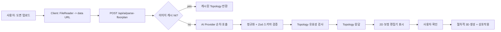

# Floorplan -> 3D Map Flow (Plan2Space)

이 문서는 사용자가 도면을 업로드한 뒤 2D 보정과 절차적 3D 생성까지 이어지는 전체 파이프라인을 상세히 설명합니다.
AI 파이프라인 세부 사항은 `docs/ai-pipeline.md`를 참조하세요.
코드 기준으로 실제 동작 경로를 따라가며, 중간에 사용되는 AI/캐시/검증 절차까지 포함합니다.

## 한눈에 보는 흐름



## 단계별 상세 플로우

### 1) 업로드 및 클라이언트 준비
- 사용자가 프로젝트 화면에서 도면 이미지를 업로드.
- 클라이언트에서 `FileReader`로 data URL 생성 후 분석 요청.
- 요청 포맷(업로드): `{ mode: "upload", base64: <dataURL>, mimeType?: "image/png" | "image/jpeg" }`
- 대상 API: `POST /api/ai/parse-floorplan`

### 1-1) 카탈로그 시작 (아파트명 + 타입)
- 요청 포맷: `{ mode: "catalog", catalogQuery: { apartmentName, typeName, region? } }`
- 서버는 템플릿 manifest에서 텍스트 매칭으로 후보를 찾고, 임계치 이상이면 검증된 topology를 반환합니다.
- 후보 없음/저신뢰면 `422 + recoverable`로 2D 수동 보정 플로우로 전환합니다.

### 2) 서버: 이미지 해시 및 캐시 검색
코드 경로: `apps/web/src/app/api/ai/parse-floorplan/route.ts`
- `computeImageHash`로 이미지 메타(가로/세로) + 해시 계산.
  - 9x8 그레이스케일 dHash 기반(픽셀 차이) + SHA-256.
- 캐시 검색 순서:
  1) 로컬 캐시(`.cache/floorplans/index.json`)에서 SHA-256 정확 매칭.
  2) dHash 해밍거리 기반 근접 매칭(기본 threshold 0, 사실상 비활성).
  3) Supabase Storage(`FLOORPLAN_CACHE_BUCKET`)에서 원격 캐시 조회.
- near-match는 이미지 크기 유사도 2차 검증을 통과한 경우에만 사용.
- 캐시 hit 시 Topology를 즉시 반환 (`cacheHit: true`).

### 3) 서버: AI Provider 순차 호출 + 후보 스코어링
Provider 순서는 환경변수에 의해 결정됩니다.
- `FLOORPLAN_PROVIDER_ORDER` 기본값: `snaptrude,anthropic,openai`
- Anthropic 모델: `ANTHROPIC_MODEL` 리스트에서 순차 시도.
- OpenAI 모델 기본값: `gpt-4o-mini`
- 전처리: Sharp로 B/W 고대비 이미지를 생성한 뒤 모델 입력으로 함께 전달.
  - grayscale → background suppression(blur+diff) → normalize → median/blur → contrast → threshold
  - 배경 억제 단계로 워터마크/컬러 채움 영향 감소
- 첫 성공 provider에서 즉시 종료하지 않습니다.
  - provider별 후보를 누적
  - 후보마다 `normalize -> refine -> validate`
  - 점수 breakdown(`topologyScore + openingScore + scaleScore - penalty`)으로 비교
  - 기하 품질 지표(축 정렬, orphan/self-intersection, opening 부착률, 외벽 루프, entrance)
  - 확장 지표(두께 이상치, opening overlap/범위 위반, exterior area sanity, scale confidence/evidence)
  - 최고점 후보 채택, 점수가 임계치 미만이면 `422`

#### 사용 AI
- Anthropic (Claude 계열): `@anthropic-ai/sdk`
- OpenAI (GPT 계열): `v1/chat/completions`
- Snaptrude: 외부 API (환경변수 기반)
- CubiCasa: 현재 비활성화 (코드 상 provider disabled)
- Anthropic은 Tool Output을 강제하여 JSON 파싱 오류를 줄임.

### 4) 응답 정규화 + 스키마 검증
- AI 응답은 JSON으로 변환 후 정규화 수행.
- 예외 케이스를 처리하면서 벽/개구부 필드를 통일:
  - `start/end` 또는 `from/to` 등 alias 정리
  - 좌표 포맷 `[x,y]` 외에 `{x,y}`, `x1/y1/x2/y2` 형태도 흡수
  - `walls`가 없을 때 `wallSegments/lines/segments` 키를 탐색
  - `openings`가 없을 때 `doors/windows` 배열을 병합
  - `topology/floorplan/result/data`로 감싼 응답은 자동 언랩
  - `opening.position`이 없으면 `offset`으로부터 계산
  - 누락된 `height`, `offset` 등을 보정
  - `opening.wallId`가 없으면 가장 가까운 벽에 자동 부착
  - `balconies/rooms/columns`는 형식이 맞는 항목만 유지하고 나머지는 제거
- Zod 스키마(`TopologySchema`)로 구조 검증.
- 유효한 경우에만 다음 단계 진행.

### 5) Topology 보정 + 유효성 검사
정규화된 결과를 좌표 스냅/정렬 후 검증합니다.
- 근접 좌표 스냅 + 수평/수직 정렬
- 일직선(콜리니어) 벽 병합
- 개구부는 가장 가까운 벽에 재부착 및 위치 보정

`validateTopology` 단계에서 구조적 품질을 보장합니다.
- 너무 짧은 벽은 제거 (`MIN_WALL_LENGTH = 30` px).
- 개구부가 벽 길이 범위를 벗어나면 제외.
- `metadata` 재계산 (벽/개구부 개수 등).
- `metadata.scaleInfo`를 항상 포함해 스케일 근거(source/confidence/evidence)를 반환.
- 스케일을 자동으로 확정할 수 없는 경우 `source="unknown"`으로 반환되며, 클라이언트에서 3D 진입을 차단.

### 6) 실패 시 폴백
모든 Provider가 실패하면 `HTTP 422`를 반환합니다.
- `errorCode=TOPOLOGY_EXTRACTION_FAILED`
- `recoverable=true`와 `details`를 포함해 2D 수동 보정으로 복구.
- 실패를 성공(200)처럼 위장하지 않습니다.

### 7) 클라이언트: 2D 보정 단계 (Human-in-the-Loop)
코드 경로: `apps/web/src/components/editor/FloorplanEditor.tsx`
- Konva 캔버스 위에 원본 도면 + 분석 결과를 오버레이.
- 제공 기능:
  - 벽 끝점 드래그 수정
  - 문/창문 위치 드래그 수정
  - 벽 추가, 문/창문 추가
  - 전체 삭제/롤백
- confidence 색상 표시:
  - 초록(`>=0.8`)
  - 노랑(`0.6~0.79`)
  - 빨강(`<0.6`)
- 사용자는 3D 생성 전에 반드시 구조를 검수 가능.

### 8) 3D 생성 확정
사용자가 “Confirm 3D Generation”을 누르면:
- `viewMode`가 "top"으로 전환
- 3D 씬이 활성화되고 절차적 생성 시작

## 3D 생성 파이프라인 (Procedural)

### 9) 3D 씬 구성
렌더링은 R3F(React Three Fiber) 기반.
구성 요소:
- `ProceduralWall`: 벽 메쉬 생성 + CSG로 개구부 뚫기
- `ProceduralFloor`: 외곽 폴리곤으로 바닥 생성
- `ProceduralCeiling`: 천장 생성 (Walk 모드에서만 표시)
- `Lights`, `SceneEnvironment`, `PostEffects`: 시각 품질 강화

### 10) 벽 생성 (CSG 적용)
코드 경로: `apps/web/src/components/canvas/features/ProceduralWall.tsx`
- 벽을 2D 선분 -> 3D extrude로 변환
- `Geometry + Base + Subtraction`으로 문/창문 구멍 생성
- 스케일 적용: `pixel 좌표 * scale` → meter 단위로 변환

### 11) 바닥/천장 생성
코드 경로:
- `apps/web/src/components/canvas/features/ProceduralFloor.tsx`
- `apps/web/src/components/canvas/features/ProceduralCeiling.tsx`
- 외곽 폴리곤 계산(`buildExteriorPolygon`)으로 실제 경계 생성.
- 실패 시 fallback rectangle 사용.

### 12) 카메라 및 모드 전환
코드 경로: `apps/web/src/components/canvas/core/CameraRig.tsx`
- Top view:
  - OrthographicCamera + MapControls
  - 회전 비활성화, 평면 기반 편집
- Walk view:
  - PerspectiveCamera + PointerLockControls
  - Rapier 기반 충돌 처리
  - entrance 문이 지정되면 입구에서 시작

### 13) Physics 충돌 처리
코드 경로: `apps/web/src/components/canvas/core/PhysicsWorld.tsx`
- Rapier 물리 월드 생성
- 벽은 개구부 위치를 제외한 segment collider로 구성
- 바닥 collider 포함
- Walk 모드에서 벽 뚫기 방지

### 14) 상호작용 레이어
- `InteractionManager`:
  - 대상 오브젝트 hover/emissive 처리
  - Top/Walk 모드에 따라 커서와 힌트 상태 변경
- `InteractiveDoors`, `InteractiveLights`:
  - 문/조명 클릭 인터랙션

## 데이터 계약 (Topology)

```json
{
  "metadata": {
    "imageWidth": 1200,
    "imageHeight": 900,
    "scale": 0.01,
    "scaleInfo": {
      "value": 0.01,
      "source": "ocr_dimension",
      "confidence": 0.82,
      "evidence": {
        "mmValue": 12530,
        "pxDistance": 1253,
        "ocrText": "12530"
      }
    },
    "unit": "pixels",
    "confidence": 0.88,
    "analysisCompleteness": {
      "totalWallSegments": 42,
      "exteriorWalls": 12,
      "interiorWalls": 30,
      "totalOpenings": 18,
      "doors": 12,
      "windows": 6,
      "balconies": 2,
      "columns": 1
    }
  },
  "walls": [
    { "id": "w1", "start": [10, 20], "end": [200, 20], "thickness": 12, "type": "exterior", "length": 190, "isPartOfBalcony": false, "confidence": 0.91 }
  ],
  "openings": [
    { "id": "o1", "wallId": "w1", "type": "door", "position": [60, 20], "width": 90, "offset": 50, "isEntrance": true, "detectConfidence": 0.88, "attachConfidence": 0.93, "typeConfidence": 0.86 }
  ]
}
```

## 실패/복구 전략
- AI 실패 시 `422 + recoverable=true`를 반환하고, 2D 편집기에서 수동 보정으로 복구.
- 캐시 hit 시 이전 분석 결과 즉시 로드.
- recoverable 실패에서는 2D 편집기에서 walls/openings를 비운 상태로 시작하고 수동 보정 안내를 표시.
- recoverable 배너에 `Copy Errors`, `Try AI Again`, `Start Manual` 고정 액션 제공.
- debug 모드에서는 `providerErrors` 외에 `candidates[]`, `selectedProvider`, `selectedScore`가 포함됨.

## 튜닝 파라미터 (선택)
이미지/스냅 정밀도는 환경 변수로 튜닝할 수 있습니다.
- `FLOORPLAN_PREPROCESS_THRESHOLD` (기본 200)
- `FLOORPLAN_PREPROCESS_MEDIAN` (기본 3)
- `FLOORPLAN_PREPROCESS_BLUR` (기본 0.3)
- `FLOORPLAN_PREPROCESS_BG_BLUR` (기본 12)
- `FLOORPLAN_PREPROCESS_CONTRAST` (기본 1.25)
- `FLOORPLAN_PREPROCESS_BRIGHTNESS` (기본 -15)
- `FLOORPLAN_SNAP_TOLERANCE` (기본 4)
- `FLOORPLAN_MERGE_GAP_TOLERANCE` (기본 6)
- `FLOORPLAN_MERGE_ALIGN_TOLERANCE` (기본 2)
- `FLOORPLAN_OPENING_ATTACH_DISTANCE` (기본 20)
- `FLOORPLAN_CACHE_DHASH_THRESHOLD` (기본 0)
- `FLOORPLAN_CACHE_SIZE_TOLERANCE_RATIO` (기본 0.02)
- `FLOORPLAN_MIN_ACCEPT_SCORE` (기본 25)
- `FLOORPLAN_EARLY_STOP_SCORE` (기본 80)

## 체크포인트 (품질 확인)
- 2D에서 벽이 닫힌 루프를 형성하는가?
- 문/창문이 벽 범위 내에 존재하는가?
- 스케일 미보정 상태에서는 3D 진입이 차단되는가?
- Walk 모드에서 벽을 뚫지 않는가?
- 천장은 Walk 모드에서만 보이는가?

## 참고 코드 위치
- 분석 API: `apps/web/src/app/api/ai/parse-floorplan/route.ts`
- 2D 편집기: `apps/web/src/components/editor/FloorplanEditor.tsx`
- 벽/바닥/천장 생성: `apps/web/src/components/canvas/features/*`
- 카메라/물리: `apps/web/src/components/canvas/core/*`
