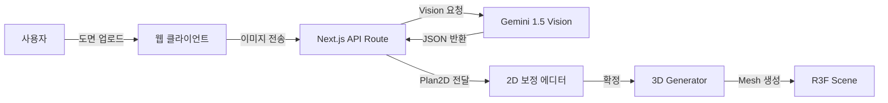

# plan2space PRD (Tech + UX Focus)

문서 목적: “도면 → 3D 자동 변환 + 몰입형 웹 워크스루 + 실시간 커스터마이징”을 중심으로, 기술적 완성도와 UX에 집중한 포트폴리오 수준의 제품 요구사항을 정의한다. **마켓플레이스/결제/프로젝트룸은 범위에서 제외**한다.

---

## 1) 프로젝트 개요

### 1.1 목표
- 2D 도면 이미지를 분석해 **3초 내** 3D 공간으로 변환
- WebGL/WebGPU 기반으로 **1인칭(FPS) 워크스루** 제공
- 벽/바닥/가구를 즉시 바꿀 수 있는 **직관적 편집 UX** 구현

### 1.2 핵심 가치
- **Automation**: 도면 한 장으로 구조 생성
- **Immersion**: 걷고, 열고, 켜는 인터랙션 중심
- **Technology**: R3F/WebGPU/물리엔진 적용

---

## 2) 기술 스택

- **Frontend**: Next.js 15 (App Router)
- **Language**: TypeScript
- **3D Engine**: React Three Fiber (R3F)
- **Graphics**: WebGL2 (기본) + WebGPU (옵션)
- **Physics**: Rapier.js (충돌/레이캐스팅)
- **State**: Zustand
- **Backend**: Supabase (Auth + Postgres + Storage)
- **AI API**: Next.js API Route (Gemini 1.5 Vision)
- **AI**: Google Gemini 1.5 (Vision)

---

## 3) 데이터 파이프라인

---

## 4) 핵심 기능

### 4.1 AI 도면 분석
- JPG/PNG 도면 업로드
- 벽/문/창/방 라벨 추출 → 표준 JSON 변환
- **2D 보정 UI 필수** (드래그/스냅/치수 보정)

### 4.2 절차적 3D 생성
- 2D 벽선 → `ExtrudeGeometry` 기반 벽 생성
- 문/창 위치에 CSG 또는 홀 컷 적용
- 폐곡선 탐지로 바닥/천장 생성

### 4.3 1인칭 워크스루
- WASD 이동 + 마우스 시점 회전
- 벽/가구 충돌 방지
- 문 클릭 → 부드러운 오픈 애니메이션

### 4.4 인테리어 커스터마이징
- 가구 라이브러리(GLB) 제공
- 드래그&드롭 배치 + TransformControls
- 벽/바닥 텍스처 교체

### 4.5 저장/불러오기
- 씬 상태(JSON) 저장
- 프로젝트 목록에서 로드
- 스냅샷 캡처(썸네일)
- Supabase DB + Storage 사용
- 로그인 기반 프로젝트 접근(RLS)

---

## 5) 범위 제외

- 마켓플레이스/업체 매칭
- 결제/정산/운영자 기능
- 실시간 협업/채팅

---

## 6) 리스크 & 대응

| 리스크 | 대응 |
| --- | --- |
| 도면 인식 정확도 | “AI 초안 + 사용자 보정” 워크플로우 필수화 |
| WebGPU 호환성 | WebGL2 폴백 기본 적용 |
| 3D 성능 저하 | InstancedMesh, LOD, 텍스처 압축 |
| 좌표계 혼동 | **1 Unit = 1 Meter** 강제, 스케일 입력 단계 추가 |

---

## 7) 구현 로드맵

- 상세 단계: `docs/roadmap.md`
